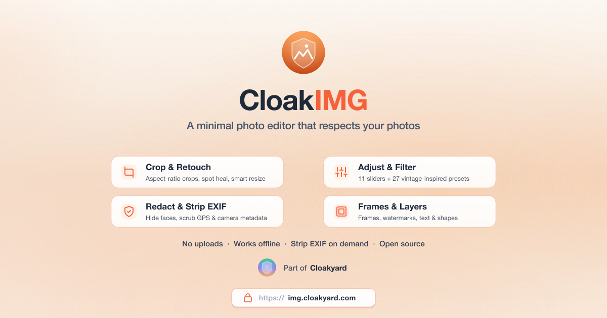

<div align="center">

  

  <p>A fast, modern, privacy-focused photo editor that runs entirely in your browser.<br>
  No uploads, no servers, no tracking — your photos never leave your device.<br>
  Includes on-device AI for subject detection, scoped tone edits, portrait blur, and background removal.</p>

  <p><strong>Try it here →</strong> <a href="https://img.cloakyard.com/">img.cloakyard.com</a></p>

  <p>
    <a href="https://opensource.org/licenses/MIT"></a>
    <a href="https://developers.cloudflare.com/workers/"></a>
    
  </p>
  <p>
    
    
  </p>

</div>

---

## ✨ Features

CloakIMG is a full-featured photo editor, all running 100% client-side:

### 🎨 Editing Tools

_Every tool you need on a single canvas. Tools tagged with ✨ use on-device AI subject detection (see below)._

| Tool                    | Description                                                                                                                                                                          |
| ----------------------- | ------------------------------------------------------------------------------------------------------------------------------------------------------------------------------------ |
| **Crop & Rotate**       | Free, fixed-ratio, or preset aspect-ratio crops. Rotate 90°, mirror, and straighten with a tilt slider                                                                               |
| **Perspective**         | Drag four corner handles to undo keystoning or warp the photo onto a target quad — async chunked warp keeps the UI responsive on big images                                          |
| **Adjust** ✨           | Exposure, contrast, highlights, shadows, whites, blacks, saturation, vibrance, temperature, vignette, sharpen, and a Catmull-Rom tone curve — scoped to whole / subject / background |
| **Levels** ✨           | Photoshop-style input black/white/gamma + output black/white sliders, scoped to whole / subject / background                                                                         |
| **Selective Colour** ✨ | Per-band Hue / Saturation / Luminance across eight colour bands, scoped to whole / subject / background                                                                              |
| **Filters** ✨          | 27 hand-tuned presets organised by character (subtle, warm, vintage, saturated, cool, cinematic, faded, sepia, monochrome) with intensity + grain — also subject/background scoped   |
| **Background Blur** ✨  | Portrait-mode-style depth-of-field — the subject stays sharp while the background gets a tunable gaussian blur                                                                       |
| **Remove BG** ✨        | One-click background removal via U²-Net (IS-Net) running locally in a Web Worker, plus a chroma-key fallback for flat studio backdrops                                               |
| **Spot Heal**           | One-tap blemish removal with content-aware patching                                                                                                                                  |
| **Redact**              | Black-bar, blur, or pixelate sensitive regions. Rectangular, freehand, and OCR-friendly text redaction                                                                               |
| **Frame**               | Polaroid, film, modern matte, and ratio frames with adjustable colour and thickness                                                                                                  |
| **Border**              | Solid pixel-thick border or aspect-padded matte (Square, 4:5, 16:9 etc.) with custom colour                                                                                          |
| **Resize**              | Lanczos-3 resampling for pin-sharp downscales — pick exact pixels, percentage, or aspect-locked dimensions                                                                           |
| **Draw & Pen**          | Pressure-sensitive freehand brush plus a vector pen with anchor handles for clean curves                                                                                             |
| **Shapes**              | Rect, rounded-rect, ellipse, lines, arrows, polygons, hearts, stars — fill, stroke, opacity                                                                                          |
| **Text**                | Multi-line text with font, weight, size, colour, italic, underline, stroke, character spacing, and curve-along-arc controls                                                          |
| **Stickers**            | Built-in sticker sets plus your own custom uploads (saved locally and reusable across sessions)                                                                                      |
| **Watermark**           | Repeatable text or image watermark with anchor + opacity                                                                                                                             |
| **Place Image**         | Composite a second photo on top — drag, scale, rotate                                                                                                                                |
| **Colour Picker**       | Eyedrop any pixel into the active swatch                                                                                                                                             |

### 🧠 On-Device AI

_Every model runs locally in your browser. Your photos are never sent anywhere._

CloakIMG includes a built-in subject-detection model ([U²-Net / IS-Net](https://github.com/xuebinqin/U-2-Net) via [@imgly/background-removal](https://github.com/imgly/background-removal-js)) that powers a handful of tools:

| Capability             | What it does                                                                                                                                                                                                              |
| ---------------------- | ------------------------------------------------------------------------------------------------------------------------------------------------------------------------------------------------------------------------- |
| **Subject scoping**    | Adjust, Levels, Selective Colour and Filters expose an _Apply to: Whole / Subject / Background_ control — common moves like "darken the background" or "boost saturation on the subject only" become a one-tap operation. |
| **Background blur**    | A new Background Blur tool keeps the subject pin-sharp while gaussian-blurring the background for a phone-style portrait look.                                                                                            |
| **Background removal** | Remove BG runs the same model end-to-end, alpha-keying your subject for transparent PNG export, sticker creation, or compositing.                                                                                         |
| **Shared cache**       | The mask is detected once per image and reused across every subject-aware tool. Trigger detection in any one of them and the rest are instantaneous.                                                                      |

**How the privacy story holds up:**

- **No server inference.** The model is loaded as static `.onnx` weights and run in a Web Worker via the [ONNX Runtime](https://onnxruntime.ai/) WebAssembly backend. Inference is read-only — nothing about your photo is sent back over the network.
- **No telemetry.** The image bytes never leave your browser tab. You can verify in DevTools → Network that the only traffic is the one-time model download.
- **First run only.** The model files (~44 MB Fast / ~88 MB Better / ~176 MB Best) download on first use and are then cached by the Service Worker. After that, every AI feature works fully offline.
- **Quality you control.** Pick the smallest model for fast detection on phones, or the largest for the cleanest edges — all three are real ONNX models, no quality-degrading client-side approximation.
- **Lazy-loaded.** Opening a subject-aware tool doesn't pull in any AI code; only picking the _Subject_ or _Background_ scope (or hitting Apply on Remove BG) actually starts the download.

### 🧭 Workspace

_Designed for fast, focused editing_

| Feature               | Description                                                                                                                     |
| --------------------- | ------------------------------------------------------------------------------------------------------------------------------- |
| **Layered editing**   | Text, watermark, watermark image, and draw layers stay non-destructive until you commit — toggle visibility, reorder, edit live |
| **Undo / Redo**       | Full history stack with keyboard shortcuts (`⌘Z` / `⌘⇧Z`) — every tool commit is reversible                                     |
| **Compare**           | Hold to flash the original side-by-side with the current edit                                                                   |
| **Reset to original** | One click rewinds the working canvas to the source image                                                                        |
| **Pan + pinch zoom**  | Two-finger gestures on touch, Space-drag + Cmd-scroll on desktop — anchored zoom that feels native                              |
| **Keyboard driven**   | Single-key shortcuts for every tool, slider nudges with arrow keys, modifier-locked rotation                                    |
| **Mobile-first**      | A bottom sheet panel, sticky toolbar, and touch-tuned hit-targets so editing on a phone never feels cramped                     |
| **Light & dark mode** | Follows your OS `prefers-color-scheme` and toggles manually from the topbar                                                     |

### 📤 Import, Export & Persistence

_Your work is always within reach_

| Feature               | Description                                                                                                |
| --------------------- | ---------------------------------------------------------------------------------------------------------- |
| **Drag, drop, paste** | Drop a file from anywhere, paste from clipboard, or pick from disk — all routed through the same code path |
| **HEIC support**      | Native HEIC/HEIF decoding via libheif-js (WASM), so iPhone photos open directly without conversion         |
| **EXIF reader**       | Inspect camera, lens, exposure, GPS, and date metadata before you export                                   |
| **EXIF stripping**    | One-tap toggles to scrub GPS, camera info, or timestamps from JPEG exports                                 |
| **Recents**           | The last 10 files you opened, stored locally in IndexedDB so you can pick up where you left off            |
| **Autosave drafts**   | Your in-progress edit is auto-saved every few seconds so an accidental close doesn't lose work             |
| **Batch mode**        | Apply the same recipe (resize, format convert, watermark, EXIF strip) across dozens of files in one pass   |
| **Export**            | JPEG, PNG, WebP — pick quality, target size bucket, and whether to retain the EXIF block                   |
| **Wide-gamut output** | Display-P3 canvas binding where supported, so colours hold up on modern phones and laptops                 |

---

## 🔒 Privacy First

|                               |                                                                                                                                  |
| ----------------------------- | -------------------------------------------------------------------------------------------------------------------------------- |
| **No uploads**                | Every byte stays on this device                                                                                                  |
| **No server-side processing** | Zero network requests for your image data — verified by a strict Content Security Policy                                         |
| **On-device AI**              | The U²-Net subject-detection model runs in a Web Worker via the ONNX Runtime WebAssembly build. Image pixels never leave the tab |
| **One-time, cached model**    | The model file is downloaded once on first AI use and cached by the Service Worker; thereafter every AI feature works offline    |
| **No data collection**        | No analytics, no tracking, no cookies                                                                                            |
| **One-tap EXIF strip**        | Scrub GPS, camera info, and timestamps from JPEG exports with a single toggle                                                    |
| **Strict CSP**                | Content Security Policy blocks any unintended egress                                                                             |
| **Fully offline capable**     | Works without an internet connection after initial load                                                                          |

---

## 🛠️ Tech Stack

| Category      | Technology                                                                                                                                                                |
| ------------- | ------------------------------------------------------------------------------------------------------------------------------------------------------------------------- |
| Framework     | [React 19](https://react.dev/)                                                                                                                                            |
| Styling       | [Tailwind CSS 4](https://tailwindcss.com/)                                                                                                                                |
| Canvas        | [Fabric.js 7](http://fabricjs.com/) for layered objects + a pure 2D canvas pipeline for filters and per-pixel ops                                                         |
| Build Tool    | [Vite+](https://vite.dev/) (Vite + Rolldown unified toolchain)                                                                                                            |
| Language      | [TypeScript 6](https://www.typescriptlang.org/)                                                                                                                           |
| HEIC Decode   | [libheif-js](https://github.com/catdad-experiments/libheif-js) — Rust/C HEIC decoder compiled to WebAssembly, lazy-loaded only when needed                                |
| On-device AI  | [@imgly/background-removal](https://github.com/imgly/background-removal-js) (U²-Net / IS-Net) running through [ONNX Runtime Web](https://onnxruntime.ai/) in a Web Worker |
| PWA / Offline | [Workbox](https://developer.chrome.com/docs/workbox) via [vite-plugin-pwa](https://vite-pwa-org.netlify.app/)                                                             |
| Toolchain CLI | [Vite+ (`vp`)](https://viteplus.dev/)                                                                                                                                     |
| Hosting       | [Cloudflare Workers](https://developers.cloudflare.com/workers/) static assets                                                                                            |

---

## 🚀 Getting Started

### Prerequisites

- **Node.js** ≥ 24.x (LTS recommended)
- **Vite+ (`vp`)** — install globally via `npm i -g vite-plus`

### Installation

```bash
# Clone the repository
git clone https://github.com/cloakyard/cloakimg.git
cd cloakimg

# Install dependencies
vp install

# Start the development server
vp dev
```

### Available Commands

| Command      | Description                               |
| ------------ | ----------------------------------------- |
| `vp dev`     | Start the Vite dev server with hot reload |
| `vp build`   | TypeScript check + production build       |
| `vp preview` | Preview the production build locally      |
| `vp check`   | Run format, lint, and type checks         |
| `vp test`    | Run tests                                 |

---

## 📁 Project Structure

```
cloakimg/
├── public/                    # Static assets (icons, manifest, OG image, 404 page)
├── src/
│   ├── main.tsx               # App entry point
│   ├── App.tsx                # Routing between landing & editor
│   ├── style.css              # Global styles + keyframes
│   ├── tokens.css             # Design tokens (colour, type, motion)
│   │
│   ├── components/            # Cross-cutting UI primitives shared by landing + editor
│   │   ├── icons.tsx            # Lucide-style icon set used app-wide
│   │   ├── ModalFrame.tsx       # Shared dialog frame (centered + bottom-sheet variants)
│   │   ├── ErrorBoundary.tsx    # Top-level render-error catch
│   │   ├── DropZone.tsx         # Drag/drop/paste + file-picker zone
│   │   ├── OrientationLock.tsx  # Portrait-only guard for narrow phones
│   │   └── SamplePhoto.tsx      # Inline sample photo for the landing CTA
│   │
│   ├── constants/             # Single source of truth for app-wide constants
│   │   └── links.ts             # GitHub repo / org / author / issues URLs
│   │
│   ├── utils/                 # Pure, stateless helpers shared across features
│   │   └── formatBytes.ts       # Exact + rough byte-count formatters
│   │
│   ├── landing/               # Landing page (hero, sunset backdrop, features, footer)
│   └── editor/                # The single-canvas editor
│       ├── EditorContext.tsx    # Document, history, layers, autosave
│       ├── ImageCanvas.tsx      # Fabric-backed canvas + pan/zoom/transform
│       ├── tools/               # One file per tool (Crop, Adjust, Filter, Redact, …)
│       └── ExportModal.tsx      # Format, quality, EXIF, target size pipeline
│
├── index.html                 # HTML entry point + meta/OG tags + CSP
├── vite.config.ts             # Vite + Tailwind + PWA configuration
├── wrangler.jsonc             # Cloudflare Workers static-assets config
├── tsconfig.json              # TypeScript configuration
└── package.json
```

### Folder conventions

- **`src/components/`** — anything that's used by _both_ the landing and the editor (or by the top-level `App` shell). Feature-local components stay inside their feature folder (`landing/`, `editor/`) so the boundary stays clear.
- **`src/constants/`** — values that are referenced from more than one place and would be painful to update if duplicated (URLs, slugs, hard-coded keys). Single-file defaults stay local; only promote here when a constant becomes shared.
- **`src/utils/`** — pure, framework-agnostic helpers. No React, no DOM-specific state, no project-specific assumptions. Domain helpers (canvas math, EXIF, colour spaces) live next to their tools instead.

---

## ⚙️ How It Works

CloakIMG is a single-page React app that keeps every photo entirely in memory and in IndexedDB.

- **One working canvas** — every tool commits its bake into a single `working` HTMLCanvasElement; `Undo` / `Redo` walk a history stack of canvas snapshots so any edit can be unwound.
- **Layered overlays** — text, watermarks, drawings, stickers, and pen paths render as live Fabric objects on top of the working bitmap. They stay non-destructive until export (or until you deliberately commit them).
- **Live previews at 25%** — Adjust and Filter previews render through a downsampled (≤720px long-edge) copy of the working canvas, so slider drags stay buttery on multi-megapixel images. The full-resolution bake runs once when you switch tools.
- **Wide-gamut path** — every off-screen canvas is bound to `display-p3` where supported, so colour-managed sources hold their punch on modern phones and laptops.
- **HEIC** — iPhone photos are decoded via libheif-js (lazy-loaded WASM) so HEIC files open without converting upstream.
- **Subject mask service** — a single `subjectMask` module-level cache holds the U²-Net cut for the active image; every subject-aware tool peeks first and only pays the inference cost when the cache misses (new image, dimensions changed). Detection runs in a Web Worker so the editor stays responsive on big photos.
- **EXIF surgery** — JPEG exports rebuild the APP1 segment from the original bytes; per-export toggles let you keep the full metadata, or selectively scrub GPS, camera info, and timestamps before download.
- **Recents + autosave** — the last 10 opened files (and an in-progress draft of your active edit) live in IndexedDB as `ArrayBuffer` payloads. Files round-trip reliably across sessions on every browser including iOS Safari.
- **PWA** — an aggressive Workbox runtime cache lets the editor open instantly and run fully offline once installed.

All operations happen in-memory or in IndexedDB. The strict Content Security Policy in [index.html](index.html) blocks any outbound network requests for user content — it is architecturally impossible for your photo to leave your device.

---

## 🚢 Deployment

CloakIMG is deployed to **Cloudflare Workers** (static assets) on every push to `main`.

The deployment pipeline:

1. Checks out the code
2. Installs dependencies with `vp install`
3. Builds the production bundle with Vite
4. Publishes the `dist/` folder to Cloudflare via Wrangler ([wrangler.jsonc](wrangler.jsonc))

The custom domain `img.cloakyard.com` is bound to the Worker through Cloudflare DNS.

---

## 🤝 Contributing

Contributions are welcome — new filter presets, tool refinements, accessibility fixes, and HEIC/RAW format coverage especially. Open an issue or a pull request to get started. See [CONTRIBUTING.md](CONTRIBUTING.md).

---

## 📄 License

This project is licensed under the **MIT License** — feel free to use it for both personal and commercial purposes. See the [LICENSE](LICENSE) file for details.

---

<p align="center">
  Built with ❤️ by <a href="https://github.com/sumitsahoo">Sumit Sahoo</a>
</p>
