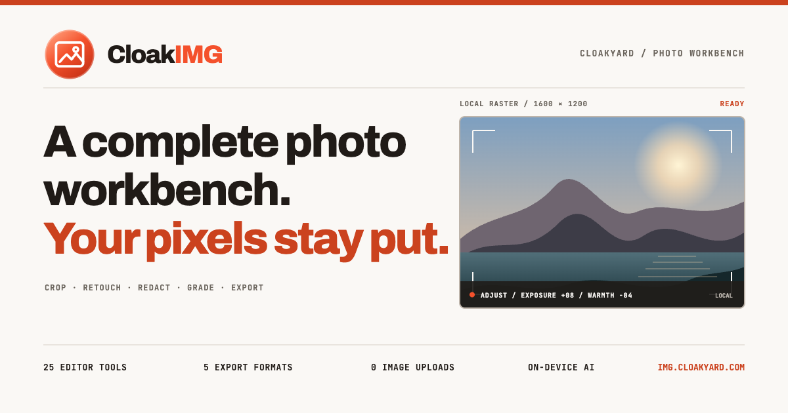

<div align="center">

  

  <p>A fast, privacy-first photo editor that runs entirely in your browser.<br>
  No uploads, no servers, no tracking — your photos never leave your device.</p>

  <p><strong>Try it →</strong> <a href="https://img.cloakyard.com/">img.cloakyard.com</a></p>

  <p>
    <a href="https://opensource.org/licenses/MIT"></a>
    
    
    
  </p>

</div>

---

## ✨ Features

Everything runs 100% client-side. Tools marked ✨ use on-device AI.

- **Edit** — Crop & Rotate, Perspective, Adjust ✨, Levels ✨, Selective Colour ✨, Filters ✨ (40+ presets incl. Seasons), Time of Day, Relight ✨ (depth-aware lighting), Resize (Lanczos-3).
- **Retouch & privacy** — Spot Heal, Portrait Blur ✨, Remove BG ✨ with transparent / solid / one-colour gradient / vignette output, Redact ✨ (blur / pixelate / solid + one-tap Smart Anonymize of people or faces), Tap-to-Fix (context-aware quick action).
- **Annotate** — Text, Shapes, Draw, Pen, Emoji, Watermark, Place Image, Colour Picker.
- **Finish** — Frame (Polaroid, Film, Cinema, Vignette + more), Border (solid or aspect-padded matte), and ID Photo sheets with 26 passport / ID / visa / custom standards, six paper sizes, exact 300-DPI PDF or print output, and cut guides enabled by default.

### 🧠 On-device AI

Models run locally — in a Web Worker, or on the main thread for face detection — so pixels never leave the tab. Nothing downloads until you accept an explicit consent dialog, and each model is cached after first use so AI keeps working offline.

| Model                                     | Powers                                                                                    | Size             |
| ----------------------------------------- | ----------------------------------------------------------------------------------------- | ---------------- |
| **ISNet (DIS)** via Transformers.js       | Subject scoping (Whole / Subject / Background), Portrait Blur, Remove BG, Smart Anonymize | 42 / 84 / 168 MB |
| **MediaPipe BlazeFace**                   | Smart Anonymize → per-face redaction                                                      | ~1 MB            |
| **Depth Anything V2** via Transformers.js | Relight (depth-aware directional light)                                                   | 28 / 49 MB       |

The subject mask is detected once per image and reused across every subject-aware tool.

### 🧭 Workspace & export

Layered non-destructive overlays · undo/redo (`⌘Z` / `⌘⇧Z`) · hold-to-compare · reset to original · pan + pinch-zoom · single-key shortcuts · light/dark mode · mobile bottom-sheet UI.

Drag/drop/paste import · HEIC decode · EXIF reader + one-tap GPS/metadata strip · recents + autosave (IndexedDB) · batch mode · export to JPEG/PNG/WebP · exact-size ID-photo PDF/print sheets · wide-gamut (Display-P3) output.

---

## 🔒 Privacy

- **No uploads, no servers, no telemetry** — every byte stays on your device; a strict CSP blocks any outbound request for image data.
- **On-device AI** — models download once (with explicit consent), cache locally, and run fully offline thereafter.
- **One-tap EXIF strip** — scrub GPS, camera info, and timestamps from exports.

---

## 🛠️ Tech Stack

|              |                                                                                 |
| ------------ | ------------------------------------------------------------------------------- |
| Framework    | React 19 + TypeScript 7                                                         |
| Styling      | Tailwind CSS 4                                                                  |
| Canvas       | Fabric.js 7 + a 2D-canvas pipeline for filters & per-pixel ops                  |
| On-device AI | Transformers.js (ISNet, Depth Anything V2) + MediaPipe Tasks Vision (BlazeFace) |
| HEIC / HEIF  | libheif + libde265 + Kvazaar (local WASM, lazy-loaded)                          |
| Build / PWA  | Vite+ (`vp`) + vite-plugin-pwa (Workbox)                                        |
| Hosting      | Cloudflare Workers — deployed on every push to `main`                           |

---

## 🚀 Getting Started

Requires **Node.js ≥ 24** and **Vite+** (`npm i -g vite-plus`).

```bash
git clone https://github.com/cloakyard/cloakimg.git
cd cloakimg
vp install   # install dependencies
vp dev       # dev server with hot reload
```

| Command              | Description                                                    |
| -------------------- | -------------------------------------------------------------- |
| `vp dev`             | Dev server with hot reload                                     |
| `vp build`           | Type-check + production build                                  |
| `vp preview`         | Preview the production build                                   |
| `vp check`           | Format, lint, and type-check                                   |
| `vp test`            | Run the unit and component suite                               |
| `vp run test:tools`  | Open every editor tool and audit names, bounds, and touch size |
| `vp run test:visual` | Audit desktop, tablet, phone, and narrow Android layouts       |
| `vp run test:audit`  | Audit shared dialogs and responsive component contracts        |

---

## 🤝 Contributing

Contributions welcome — new filter presets, tool refinements, accessibility fixes, and HEIC/RAW coverage especially. See [CONTRIBUTING.md](CONTRIBUTING.md).

## 📄 License

MIT — see [LICENSE](LICENSE).

<p align="center">Built with ❤️ by <a href="https://github.com/sumitsahoo">Sumit Sahoo</a></p>
